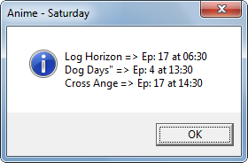
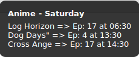
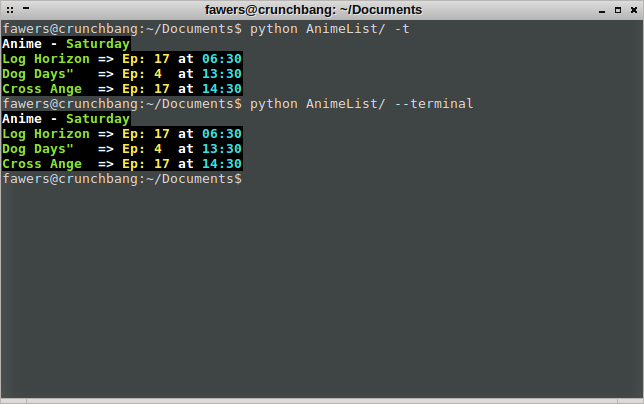

Anime List
==========

### What is this about?
*Anime List* is about having the shows you're watching in a text file so you can keep track of them.

### How is this different from [MyAnimeList][AniList]?
Unlike [MyAnimeList][AniList], Anime List is not meant to save all of your watched shows and count episodes, etc. Anime List is actually meant for people who want to have a hint of what is airing in the current day. The software reads from a text file, which contains anime titles, and search for those titles on [AnimeCalendar][AniCal]; the ones airing in the current day will be shown, alongside with their respective episode numbers and airtimes. Remember this is about keeping track of the shows you're currently watching!

### Cool! How does it look like?
* On Windows:
 *
* On Linux:
 *
* On a Linux terminal:
 *

### That seems nice! But how should I organize a list for me?
By default, the software will look for a file called `anime_list`, without extension. You can name it whatever you'd like to, as long as you change its name in the `settings` file later. For instance, if you want to append the `.txt` extension in the name so you can easily open it on Notepad, you just have to append the same `.txt` to the `filename` setting in the `settings` file.

### What are these "strings" files?
`strings.en` and `strings.ptbr` are what Anime List is going to show, depending on what the `language` setting is set to. If it's set to `en`, then the software will show text in English. If it's set to `ptbr` instead, then it will show text in Brazilian Portuguese. `strings.py` is the code responsible for loading the correct file so it can show the correct language.

### I think I'll have a copy of this program.
Go ahead! I chose to make this software free and open-source. All you have to do is, either clone the repo or [download](https://github.com/Fawers/anime-list/archive/master.zip) the whole thing a `.zip`. Just make sure you have [Python2.7](https://www.python.org/) installed on your machine before running the program. By the way, you can run it by double-clicking on `__main__.py` or by running either `python __main__.py` or `python anime-list` (`anime-list` is the folder name here).

### Can you give an example of how a list should look like?
Sure. In the file itself, a semi-colon (`;`) in the beggining of a line may be used to indicate a comment, which will be ignored by the software. This is a very basic syntax that has been imaginated to help organizing titles and queries. The website used to search for titles is [AnimeCalendar][AniCal].

### What exactly are these titles and queries?
A title is what the show is called, and also what you want your screen to show. A query is what you want the software to search on the website. Queries should differ from titles somehow.

### Why organizing titles and queries?
There are some titles on [AnimeCalendar][AniCal] that are misspelled, e.g., Nanatsu no Taizai. If you look for Nanatsu no Taizai, you'll find Nanatsu no Taiza instead. That means, searching for 'Nanatsu no Taizai' won't show any results.

### How can I tell title from query?
As said earlier, the syntax is very basic. All you have to do is separate a title from a query using a right arrow: `->`. So, `Nanatsu no Taizai -> nanatsu no taiza` will search for `nanatsu no  taiza` and show `Nanatsu no Taizai` when found. Leading and trailing spaces are stripped, which means `title->query` will be treated just like  
`  title         ->      query` would be.

### May I omit queries?
Yes. If the query is the exact same thing as the title, then you can omit the query and the title will be used as the query as well, which means that `Isuca -> Isuca` is essentially the same thing as just `Isuca`.

***

**Queries are case-insensitive.** It doesn't matter if you write `dog days`, or `DOG DAYS`, or even `DoG DaYS`they will be treated the same way.
Insert a question mark when you don't know how to represent a certain character. For example, `Shinmai Maō no Testament`: in this case, the query should (but doesn't need to) be `shinmai ma? no testament`, without the quotes. These question marks will then be converted to the `.*` regex pattern.

***

**The displaying of the message will be different for Linux and Windows.** On Linux, `notify-send` will be used to show titles airing in the current day; on Windows, a small `.vbs` script will be created, and the function `MsgBox` will be used. There will also be a terminal alternative for Linux, which will use ANSI color codes to "prettify" generated output.

***

Example list: anime_list
----------------------------

    ; Use semi-colons to write comments,
    ; which will be ignored by the software.
    ;
    ; Remember to use the title->query syntax
    ; when the search term differs from the title.
    ;
    Cross Ange
    Dog Days" -> dog days
    Isuca
    Junketsu no Maria
    Log Horizon
    Nanatsu no Taizai -> nanatsu no taiza
    ; Remember also to use a question mark when you
    ; don't know how to represent a character.
    Shinmai Maou no Testament -> shinmai ma? no testament
    Seiken Tsukai no World Break
    Tokyo Ghoul √A -> tokyo ghoul

**Final note:** prefer to place the software in a place where you have write permissions  
(somewhere like `$HOME` (linux) or `%USERPROFILE%` (windows))

#### Dependencies
* Python2.7

#### To run
* Either run `python <foldername>` or `python __main__.py`

| Contact |
| [http://fb.com/fswerneck] |
| <fabricioswerneck@gmail.com> |

[AniList]: http://myanimelist.net/
[AniCal]: http://animecalendar.net/
